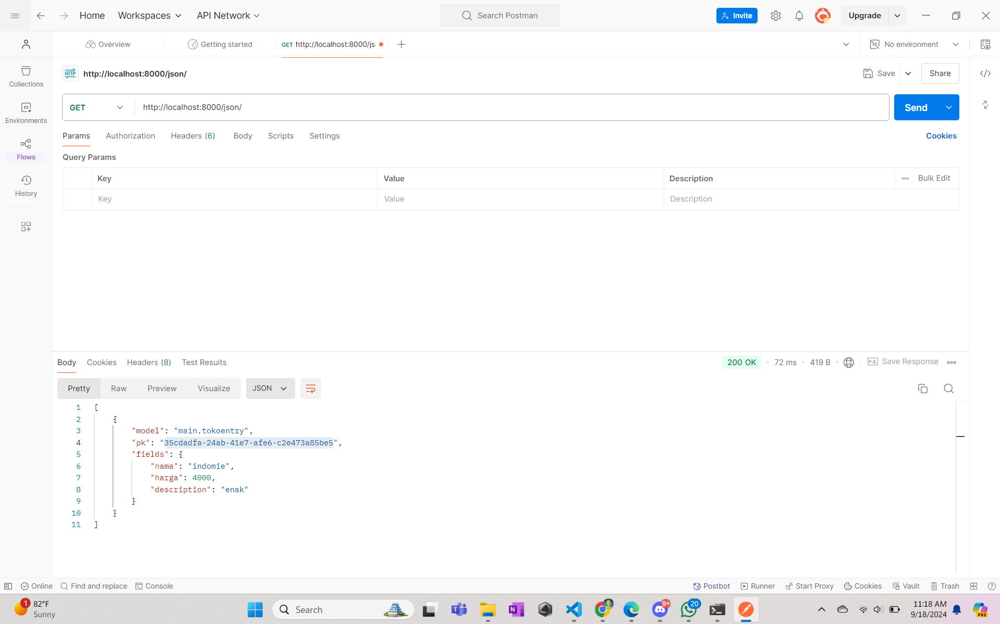
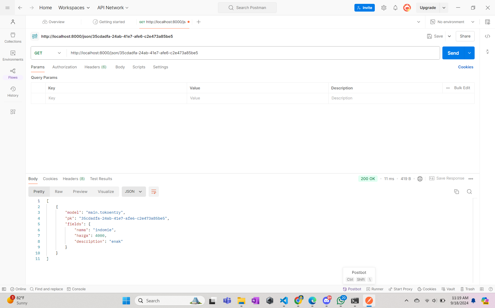
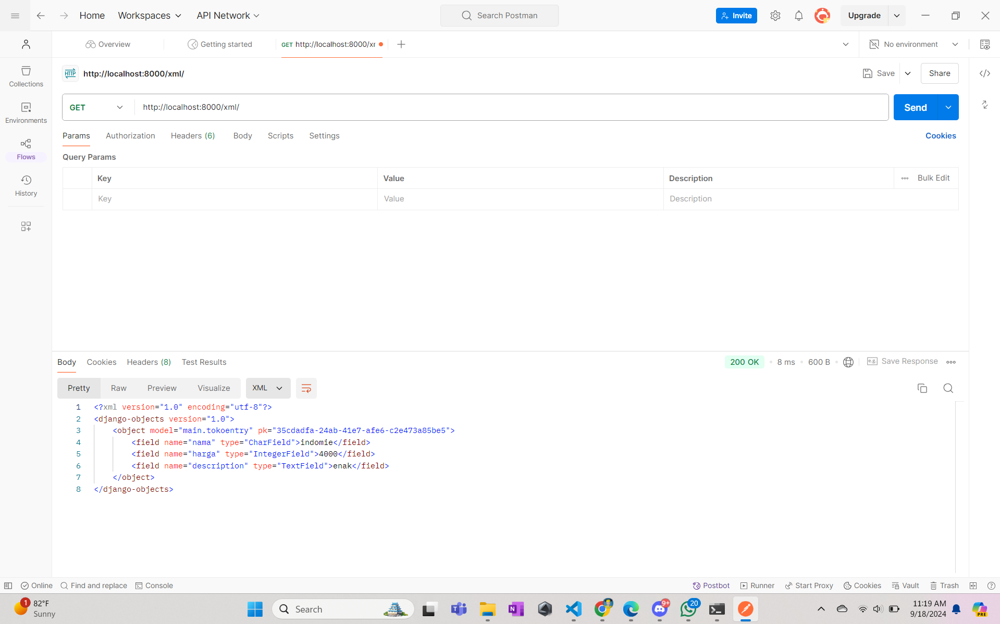
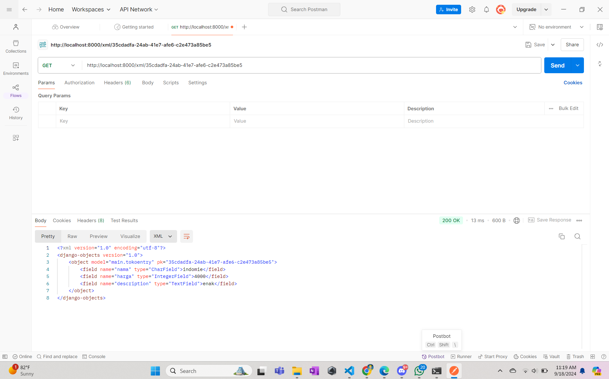

Jelaskan bagaimana cara kamu mengimplementasikan checklist di atas secara step-by-step (bukan hanya sekadar mengikuti tutorial)
- Membuat sebuah proyek Django, yang bernama fitvisual kemudian dihubungkan ke repo di GitHub
- Dilanjutkan dengan membuat aplikasi dengan nama main pada proyeknya
- Routing pada prroyek agar dapat dijalankan dalam app main
- Membuat Model Product pada main di file models.py, kemudian define atribute name, harga, description
- Membuat fungsi di views.py untuk menampilkan data 
- Membuat routing di urls.py
- Melakukan Deployment ke PWS setelah selesai

Buatlah bagan yang berisi request client ke web aplikasi berbasis Django beserta responnya dan jelaskan pada bagan tersebut kaitan antara urls.py, views.py, models.py, dan berkas html.

Jelaskan fungsi git dalam pengembangan perangkat lunak!
Git adalah alat yang sangat penting dalam pengembangan perangkat lunak karena memungkinkan pengembang untuk melacak perubahan kode secara efektif, bekerja sama dalam tim dengan mudah, dan membuat cadangan kode. Dengan Git, kami bisa dengan bebas bereksperimen tanpa takut merusak kode utama dikarenakan dapat kembali ke versi sebelumnya jika diperlukan. Selain itu Git juga bisa berkolaborasi dengan orang lain dengan fitur sepereti branch dan merge

Menurut Anda, dari semua framework yang ada, mengapa framework Django dijadikan permulaan pembelajaran pengembangan perangkat lunak?
Karena kemudahannya dalam dipahami dan kelengkapan fitur-fiturnya. Selain itu, Django hadir dengan banyak fitur bawaan yang berguna, seperti ORM, sistem templating, dan sistem autentikasi pengguna, sehingga kami dapat membangun aplikasi web yang kompleks dengan lebih cepat. Bahasa Python yang mendasari Django juga dikenal mudah dipelajari dan memiliki sintaks yang bersih, membuatnya menjadi pilihan yang populer di berbagai bidang.

Mengapa model pada Django disebut sebagai ORM?
Model di Django disebut ORM (Object-Relational Mapping) karena menghubungkan objek Python dengan tabel database. ORM adalah teknik yang memungkinkan untuk berinteraksi dengan database menggunakan objek dan kelas dalam kode Python tanpa perlu menulis SQL secara langsung

Soal Tugas 3 
1. Jelaskan mengapa kita memerlukan data delivery dalam pengimplementasian sebuah platform?
Kita memerlukan data delivery untuk
- Efisiensi Operasional
Data delivery membuat kita dapat mengirim data yang cepat dan akurat, sehingga memudahkan pengelolaan operasional. Contohnya, dalam sistem pengiriman barang, data delivery dapat menyajikan informasi real-time tentang status pengiriman, seperti lokasi dan waktu kedatangan, sehingga memperbaiki kepuasan pelanggan dan meningkatkan efisiensi logistik.
- Transparansi dan Akuntabilitas
Data delivery memberikan transparansi dalam proses pengiriman data. Contohnya, dalam platform pembayaran pemerintah, data delivery  menyajikan informasi transaksi secara digital, meminimalkan biaya penyimpanan dokumen, dan meningkatkan akuntabilitas dalam proses pembayaran.
- Penggunaan Teknologi yang Efektif
Data delivery seringkali menggunakan teknologi seperti IoT (Internet of Things) dan platform seperti Google Cloud Pub/Sub, yang memungkinkan pengiriman data dalam skala besar dengan keandalan tinggi. Contohnya, dalam implementasi IoT oleh Antares, data delivery memungkinkan pengiriman data real-time tentang kebocoran air, meminimalisir kebocoran dan meningkatkan efisiensi pengelolaan air minum.
- Pengurangan Biaya
Data delivery dapat mengurangi biaya operasional dengan mengurangi kebutuhan untuk dokumen fisik dan kurir. Contohnya, dalam implementasi platform pembayaran pemerintah, data delivery memungkinkan transaksi digital tanpa media kertas, mengurangi biaya penyimpanan dokumen dan kurir.
- Peningkatan Kualitas Layanan
Data delivery memungkinkan penyajian informasi yang akurat dan real-time, sehingga meningkatkan kualitas layanan. Contohnya, dalam sistem pengiriman barang, data delivery dapat memberikan ETA (Estimated Time of Arrival) yang akurat, memudahkan pengambilan keputusan dan meningkatkan kepuasan pelanggan.

Dengan demikian, data delivery adalah komponen penting dalam pengimplementasian sebuah platform karena memungkinkan efisiensi operasional, transparansi, akuntabilitas, penggunaan teknologi yang efektif, pengurangan biaya, dan peningkatan kualitas layanan.

2. Menurutmu, mana yang lebih baik antara XML dan JSON? Mengapa JSON lebih populer dibandingkan XML?
JSON lebih baik dan lebih populer dibandingkan XML karena beberapa alasan:
- Simplicity dan Kompatibilitas
JSON memiliki sintaks yang lebih sederhana dan mudah dibaca, membuatnya lebih fleksibel dan mudah digunakan dalam berbagai konteks, terutama dalam pengembangan web dan aplikasi seluler. XML, meskipun memiliki kelebihan dalam struktur dokumen yang kompleks, memiliki sintaks yang lebih bertele-tele dan memerlukan parser khusus untuk penguraian, sehingga lebih sulit digunakan.
- Kecepatan dan Efisiensi
JSON lebih cepat dalam parsing data karena dapat diuraikan dengan fungsi JavaScript standar, sedangkan XML memerlukan pengurai khusus yang lebih lambat. JSON juga memiliki ukuran yang lebih kecil, sehingga lebih efisien dalam pengiriman data melalui jaringan.
- Kompatibilitas dengan JavaScript
JSON dirancang untuk kompatibilitas dengan JavaScript, sehingga dapat langsung diproses sebagai objek JavaScript, yang membuatnya sangat mudah digunakan dalam pengembangan web. XML, meskipun dapat digunakan dengan berbagai bahasa pemrograman, tidak memiliki integrasi yang sebaik dengan JavaScript seperti JSON.
- Penggunaan dalam Web Development
JSON sangat populer dalam pengembangan web karena dapat digunakan dalam AJAX requests dan REST APIs, serta mendukung penyimpanan data yang lebih ringan dan cepat. XML, meskipun masih digunakan dalam beberapa konteks, tidak sepopuler JSON dalam pengembangan web modern.

Oleh karean itu JSON lebih populer karena kelebihan-kelebihannya dalam hal simpelitas, kecepatan, dan kompatibilitas dengan JavaScript, lebih ideal untuk penggunaan dalam pengembangan web dan aplikasi seluler.

3. Jelaskan fungsi dari method is_valid() pada form Django dan mengapa kita membutuhkan method tersebut?
Metode is_valid() pada form Django adalah sebuah fungsi yang sangat penting dalam proses validasi data :

Fungsi is_valid()
- Validasi Data 
Metode is_valid() digunakan untuk memvalidasi data yang diinputkan oleh pengguna. Ini berarti bahwa metode ini akan memeriksa apakah data yang diinputkan memenuhi semua aturan validasi yang telah ditetapkan untuk form tersebut.
- Pengecekan Aturan Validasi 
Metode ini akan memeriksa setiap field form dan memastikan bahwa data yang diinputkan tidak mengandung kesalahan. Jika semua data valid, maka metode is_valid() akan mengembalikan nilai True, sedangkan jika ada kesalahan, maka akan mengembalikan nilai False.
- Penggunaan dalam Model Forms 
Pada model forms, metode is_valid() juga akan memanggil metode full_clean() pada instance model untuk memvalidasi data secara lebih lanjut, termasuk memastikan bahwa field-field yang unik memenuhi syarat unikitas.

Kebutuhan Metode is_valid()
- Menghindari Kesalahan 
Dengan menggunakan metode is_valid(), pengembang dapat menghindari kesalahan yang mungkin terjadi karena input yang tidak valid. Ini memastikan bahwa data yang disimpan ke dalam database adalah akurat dan valid.
- Meningkatkan Kualitas Aplikasi 
Metode ini membantu meningkatkan kualitas aplikasi Django dengan memastikan bahwa pengguna tidak dapat menyimpan data yang tidak valid. Hal ini juga meningkatkan kepercayaan pengguna terhadap aplikasi.
- Mengurangi Kerusakan Data 
Dengan memvalidasi data sebelum disimpan, metode is_valid() dapat mengurangi kerusakan data yang mungkin terjadi karena input yang tidak valid. Ini sangat penting dalam aplikasi yang membutuhkan data yang akurat dan terpercaya.

4. Mengapa kita membutuhkan csrf_token saat membuat form di Django? Apa yang dapat terjadi jika kita tidak menambahkan csrf_token pada form Django? Bagaimana hal tersebut dapat dimanfaatkan oleh penyerang?

csrf_token (Cross-Site Request Forgery token) adalah sebuah fitur keamanan yang sangat penting dalam Django untuk mencegah serangan Cross-Site Request Forgery (CSRF):

- Mencegah Serangan CSRF
CSRF adalah serangan yang memanfaatkan keadaan pengguna sudah terautentikasi di suatu situs web. Serangan ini dapat membuat pengguna melakukan aksi yang tidak mereka inginkan, seperti transfer dana, perubahan email, dan lain-lain. Dengan menggunakan csrf_token, Django dapat memastikan bahwa setiap permintaan POST yang masuk dari pengguna adalah valid dan berasal dari pengguna yang sudah terautentikasi.

Jika kita tidak menambahkan csrf_token pada form Django, maka penggunaan form tersebut dapat terbuka bagi serangan CSRF. Berikut adalah apa yang dapat terjadi:

- Serangan CSRF Berhasil
Tanpa csrf_token, serangan CSRF dapat berhasil dan membuat pengguna melakukan aksi yang tidak mereka inginkan. Contohnya, serangan dapat membuat pengguna transfer dana atau perubahan email tanpa mereka sadari.
- Kerusakan Data dan Keamanan
Serangan CSRF yang berhasil dapat menyebabkan kerusakan data dan keamanan. Hal ini karena serangan dapat memanfaatkan keadaan pengguna sudah terautentikasi untuk melakukan aksi yang tidak sah.

Penyerang dapat memanfaatkan kekurangan csrf_token dengan cara berikut:

- Membuat Link atau Form Malicious
Penyerang dapat membuat link atau form yang mengandung permintaan POST yang tidak valid. Jika pengguna yang sudah terautentikasi mengklik link atau mengisi form tersebut, maka permintaan POST tersebut akan dijalankan tanpa memeriksa apakah memiliki csrf_token yang valid.
- Menggunakan Token Lain
Penyerang juga dapat mencoba menggunakan token lain yang tidak valid untuk mengelabui sistem. Namun, karena csrf_token di-Django selalu diubah secara acak setiap kali pengguna login, maka kemungkinan ini sangat kecil.

Dengan demikian, menambahkan csrf_token pada form Django adalah sangat penting untuk mencegah serangan CSRF dan menjaga keamanan aplikasi.

5. Jelaskan bagaimana cara kamu mengimplementasikan checklist di atas secara step-by-step (bukan hanya sekadar mengikuti tutorial).

Langkah 1 : Membuat Input Form untuk Menambahkan Objek Model
- Menentukan Model
- Membuat Form untuk Model
- Membuat View untuk Form Input
- Membuat Template

Langkah 2 : Membuat 4 Fungsi Views untuk Menampilkan Data dalam Format XML dan JSON
- View untuk Menampilkan Semua Objek dalam Format JSON
- View untuk Menampilkan Semua Objek dalam Format XML
- View untuk Menampilkan Objek Berdasarkan ID dalam Format JSON
- View untuk Menampilkan Objek Berdasarkan ID dalam Format XML

Langkah 3 : Membuat Routing URL untuk Setiap Views
- Menambahkan URL pada urls.py

Langkah 4 : Testing dan Penyempurnaan

Soal Tugas 4
1. Perbedaan antara HttpResponseRedirect() dan redirect():
   - HttpResponseRedirect(): Fungsi ini digunakan secara eksplisit untuk melakukan pengalihan ke URL tertentu. Dalam penggunaannya, user harus memberikan URL tujuan secara manual.
   - redirect(): Ini adalah fungsi pintasan di Django yang menawarkan fleksibilitas lebih. user dapat memberikan URL sebagai string atau menggunakan nama view, yang memungkinkan penggunaan URL dinamis dengan parameter.

2. Cara menghubungkan model Product dengan User:
Untuk menghubungkan model Product dengan User, Django biasanya menggunakan relasi ForeignKey atau ManyToManyField, tergantung pada kebutuhan aplikasi:

   - Menggunakan ForeignKey: Jika satu produk hanya dimiliki oleh satu pengguna, maka relasi yang tepat adalah ForeignKey. Ini menciptakan hubungan "banyak-ke-satu" (banyak produk dapat dimiliki oleh satu pengguna). Contoh implementasinya adalah sebagai berikut:

   - Menggunakan ManyToManyField: Jika produk dapat dimiliki oleh banyak pengguna (misalnya dalam kolaborasi), maka digunakan ManyToManyField:
     
3. Perbedaan antara authentication dan authorization serta proses login pengguna:
   - Authentication: Merupakan proses verifikasi identitas pengguna dengan meminta username dan password. Authentication memeriksa apakah kredensial pengguna cocok dengan informasi yang ada di database. Jika cocok, pengguna dianggap terotentikasi.
   - Authorization: Proses ini menentukan hak akses pengguna setelah mereka terotentikasi. Authorization memastikan apakah pengguna memiliki izin untuk melakukan tindakan tertentu, seperti mengakses halaman tertentu atau mengubah data.

   Saat pengguna login, proses ini merupakan bagian dari authentication. Django memvalidasi kredensial yang dikirimkan (username dan password) dengan membandingkannya dengan data di database. Jika valid, Django akan mengotentikasi pengguna dan membuat sesi login.

   Django mengimplementasikan kedua konsep ini melalui middleware dan backend otentikasi. Ketika pengguna login, Django menciptakan sesi yang menyimpan status login pengguna dan menggunakan framework permissions untuk menangani authorization, memastikan bahwa pengguna memiliki izin yang sesuai untuk mengakses sumber daya tertentu berdasarkan grup atau level akses.

4. Bagaimana Django mengingat pengguna yang telah login? Kegunaan lain dari cookies dan keamanan cookies:
   - Pengingat Pengguna Login: Django mengingat pengguna yang telah login menggunakan sesi. Setelah berhasil login, informasi tentang pengguna disimpan dalam sesi yang diidentifikasi oleh cookie yang dikirim ke browser. Cookie ini berisi ID sesi yang digunakan untuk melacak pengguna antara berbagai permintaan HTTP.
   
   - Kegunaan Cookies Lainnya: Cookies digunakan untuk menyimpan data penting lainnya dalam aplikasi, seperti:
     - Menyimpan preferensi pengguna (seperti tema atau bahasa).
     - Melacak keranjang belanja dalam aplikasi e-commerce.
     - Mencatat aktivitas pengguna untuk analitik.
     - Menyimpan token otentikasi untuk sesi login jangka panjang.

   - Keamanan Cookies: Tidak semua cookies aman digunakan. Cookies bisa menjadi target pihak ketiga atau hacker untuk pencurian data jika tidak dienkripsi atau diatur dengan benar. Oleh karena itu, cookies penting seperti cookies sesi atau otentikasi harus dilindungi dengan:
     - Secure flag: Agar hanya dikirim melalui HTTPS.
     - HttpOnly flag: Agar tidak dapat diakses oleh JavaScript, mencegah serangan XSS (Cross-site Scripting).
     - SameSite flag: Untuk mencegah pengiriman cookie lintas situs yang tidak diinginkan, mencegah serangan CSRF (Cross-site Request Forgery).

5. Langkah-langkah Implementasi Checklist

Pertama, kita membuat fungsi dan halaman registrasi dengan mengimpor `UserCreationForm` dan `message` dari `django.contrib.auth`. Fungsi `UserCreationForm` memudahkan pembuatan formulir pendaftaran user dalam aplikasi web. Selanjutnya, kita menambahkan fungsi `registrasi` yang bertujuan menghasilkan formulir registrasi dan membuat akun pengguna saat formulir tersebut di-submit. Setelah itu, kita membuat berkas HTML baru yang menyajikan halaman pendaftaran bagi pengguna baru. Formulir ini mengumpulkan data pendaftaran dan mengirimkannya ke server secara aman. Dengan sistem pesan, pengguna dapat menerima umpan balik terkait status pendaftaran mereka. Kemudian, fungsi registrasi diimpor di `views.py` dan `path` ditambahkan ke dalam `urlpatterns`.

Kedua, kita membuat fungsi login dengan mengimpor beberapa modul seperti `authenticate`, `login`, dan `AuthenticationForm`. Modul-modul ini digunakan untuk proses autentikasi dan login. Kemudian, kita menambahkan fungsi `login_user` di `views.py`, di mana fungsi ini memproses login pengguna. Jika valid, fungsi ini membuat sesi untuk pengguna yang berhasil login. Selain itu, kita membuat berkas HTML baru bernama `login.html`, yang berfungsi sebagai template untuk pengguna agar dapat login ke aplikasi, serta memberikan opsi untuk mendaftar jika mereka belum memiliki akun.

Ketiga, kita membatasi akses ke halaman utama dengan menambahkan impor `login_required`, yang merupakan decorator untuk mewajibkan pengguna login terlebih dahulu sebelum mengakses halaman tertentu. Kita menambahkan `@login_required(login_url='/login')` agar halaman utama hanya bisa diakses oleh pengguna yang sudah login. Setelah itu, kita menjalankan proyek Django dan membuka alamat http://localhost:8000/.

Keempat, kita memanfaatkan data dari cookie untuk menampilkan informasi `last_login` di halaman utama. Kita membuka file `views.py` dan mengimpor beberapa fungsi seperti `HttpResponseRedirect`, `reverse`, dan `datetime`. Kemudian, kita menambahkan fungsionalitas cookie bernama `last_login` untuk mencatat kapan terakhir kali pengguna login. Pada fungsi `show_main`, kita tambahkan `'last_login': request.COOKIES['last_login']`, yang bertujuan menampilkan informasi cookie `last_login` pada respons halaman web. Selanjutnya, kita mengubah fungsi `logout_user` dengan menambahkan `response.delete_cookie('last_login')` untuk menghapus cookie `last_login` saat pengguna logout. Kita juga menambahkan pesan yang akan ditampilkan di halaman utama mengenai sesi terakhir login. Setelah itu, proyek Django dijalankan kembali.

Kelima, untuk melihat cookie pada proyek, kita membuka protokol localhost di Chrome, klik kanan pada halaman web, pilih `inspect`, lalu klik tanda di samping `Memory (>>)`, kemudian pilih tab `Application` dan periksa cookie.

Keenam, kita menghubungkan `moodentry` dengan pengguna dengan mengimpor `User` dari `django.contrib.auth.models` di `models.py`. Kemudian, kita menambahkan variabel `user` yang menghubungkan setiap entri produk dengan satu pengguna melalui relasi. Setiap entri produk akan terasosiasi dengan pengguna tertentu. Selanjutnya, kita menambahkan beberapa kode di `views.py` dengan parameter `commit=False` untuk mencegah Django langsung menyimpan objek form ke database. Kita mengubah nilai dari `product_entries` dan `context` untuk menampilkan entri produk yang terasosiasi dengan pengguna yang login. Kode `request.user.username` digunakan untuk menampilkan nama pengguna yang login. Setelah semua perubahan disimpan, kita menjalankan migrasi, dan ketika terjadi error, kita memilih angka 1 untuk menetapkan nilai default pada field `user` di setiap baris yang sudah ada. Terakhir, kita mengimpor `os` dan mengganti variabel `DEBUG` dengan kode yang disediakan.

Soal Tugas 5
1. Urutan Prioritas Pengambilan CSS Selector
   Dalam CSS, ketika beberapa selector diterapkan ke elemen yang sama, urutan prioritasnya mengikuti aturan yang dikenal sebagai specificity. Urutan prioritasnya adalah sebagai berikut:
   - Inline style (misalnya, gaya CSS langsung pada elemen) memiliki prioritas tertinggi.
   - ID selector (#id) memiliki prioritas lebih tinggi dibandingkan class, atribut, atau elemen.
   - Class, pseudo-class, dan attribute selector (.class, :hover, [type="text"]) memiliki prioritas lebih tinggi dibandingkan elemen.
   - Type selector (tag HTML seperti div, p) dan pseudo-element (::before, ::after) memiliki prioritas paling rendah.
   Selain itu, penggunaan kata kunci !important akan mengesampingkan urutan prioritas biasa, meskipun penggunaannya sebaiknya dibatasi untuk situasi tertentu karena dapat menyebabkan kode sulit dipelihara.

2. Mengapa Responsive Design Penting dalam Pengembangan Aplikasi Web?
   Responsive design menjadi penting karena pengguna mengakses aplikasi web dari berbagai perangkat dengan ukuran layar yang berbeda, seperti smartphone, tablet, dan desktop. Tujuan responsive design adalah memastikan tampilan dan fungsionalitas situs web dapat beradaptasi dengan baik di semua perangkat, meningkatkan pengalaman pengguna (user experience).

   Contoh aplikasi yang sudah menerapkan responsive design:
   - Amazon: Menyediakan pengalaman belanja yang optimal di berbagai ukuran layar, baik di desktop, tablet, maupun ponsel.
   - Medium: Situs ini menyesuaikan tata letak dan ukuran font sesuai dengan perangkat pengguna.

   Contoh aplikasi yang belum menerapkan responsive design:
   - Situs web lama yang dirancang hanya untuk desktop, tanpa mempertimbangkan tampilan mobile, seperti situs web korporasi yang ketinggalan zaman.

3. Perbedaan antara Margin, Border, dan Padding:
   - Margin: Area di luar border yang memberi ruang antara elemen HTML dan elemen lainnya di sekitarnya. Misalnya: margin: 10px;.
   - Border: Batas di sekitar padding dan konten elemen. Border bisa diberi warna, gaya, dan ketebalan. Misalnya: border: 1px solid black;.
   - Padding: Ruang di dalam border dan di luar konten. Padding memberi jarak antara konten dan tepi elemen. Misalnya: padding: 20px;.

4. Konsep Flexbox dan Grid Layout Beserta Kegunaannya:
   - Flexbox: Sistem layout satu dimensi yang digunakan untuk mengatur elemen secara horizontal atau vertikal dalam satu baris atau kolom. Flexbox sangat berguna untuk membuat tata letak yang fleksibel dan menyesuaikan ukuran elemen dalam container, misalnya mengatur menu navigasi, galeri gambar, atau elemen card.
   - Grid Layout: Sistem layout dua dimensi yang memungkinkan elemen diatur dalam baris dan kolom. Grid cocok digunakan untuk membuat tata letak yang kompleks, seperti dashboard, layout halaman web, atau tata letak aplikasi.
Perbedaan utama:
   - Flexbox lebih cocok untuk tata letak satu dimensi (baik baris atau kolom).
   - Grid lebih cocok untuk tata letak dua dimensi (baris dan kolom).

5. Jelaskan bagaimana cara kamu mengimplementasikan checklist di atas secara step-by-step (bukan hanya sekadar mengikuti tutorial)!
- Mengintegrasikan Tailwind ke aplikasi melalui templates/base.html dengan <script src="https://cdn.tailwindcss.com">.
- Menambahkan fitur edit produk melalui main.html, views.py, urls.py, dan edit_product.html.
- Menambahkan fitur hapus produk melalui views.py, urls.py, dan main.html.
- Menambahkan navbar melalui navbar.html dan menautkannya ke main.html, create_product.html, dan edit_product.html.
- Mengonfigurasi static files melalui settings.py.
- Menambahkan styling dengan Tailwind dan CSS eksternal.

Soal Tugas 6
1. Manfaat Penggunaan JavaScript dalam Pengembangan Aplikasi Web:
   - Interaktivitas: JavaScript memungkinkan pengembangan elemen interaktif di halaman web seperti form dinamis, efek visual, dan animasi yang memberikan pengalaman yang lebih responsif bagi pengguna.
   - Pengolahan Data di Client-Side: JavaScript dapat digunakan untuk validasi form, pengolahan data, dan manipulasi DOM di sisi pengguna, sehingga mengurangi beban server.
   - Pengembangan Asynchronous (AJAX): Dengan menggunakan JavaScript, aplikasi web dapat memuat data secara dinamis tanpa harus me-refresh halaman secara keseluruhan, yang menghasilkan pengalaman pengguna yang lebih mulus.
   - Kompatibilitas Cross-Browser: JavaScript didukung di hampir semua browser modern, yang menjadikannya pilihan yang tepat untuk pengembangan aplikasi web.
   - Ecosystem yang Kuat: JavaScript memiliki ekosistem yang luas dengan berbagai framework dan library seperti React, Vue, dan Angular yang mempermudah pengembangan aplikasi web yang kompleks.

2. Fungsi await dalam Penggunaan fetch():
   await digunakan untuk memberitahu JavaScript agar menunggu hasil dari operasi asynchronous seperti fetch() sebelum melanjutkan eksekusi kode berikutnya. Dengan kata lain, await membuat kode berhenti sejenak hingga data dari server dikembalikan.

   Tanpa await:
   Jika kita tidak menggunakan await, JavaScript tidak akan menunggu hasil dari fetch(), melainkan akan langsung melanjutkan eksekusi ke baris berikutnya, bahkan jika data belum selesai diambil dari server. Hal ini bisa menyebabkan bug karena kode mungkin akan mencoba mengakses data yang belum ada atau mengoperasikan hasil yang belum selesai diproses.

3. Mengapa Menggunakan csrf_exempt untuk AJAX POST?:
   CSRF (Cross-Site Request Forgery) adalah serangan yang memanfaatkan kepercayaan server pada request dari pengguna yang telah diautentikasi. Django secara default menerapkan perlindungan terhadap serangan ini dengan token CSRF pada form POST. Namun, ketika kita menggunakan AJAX POST, permintaan yang dibuat secara manual dari JavaScript mungkin tidak secara otomatis menyertakan token CSRF, yang akan menyebabkan request tersebut ditolak oleh server.

   Untuk mencegah ini, kita dapat menggunakan decorator csrf_exempt pada view yang digunakan untuk AJAX POST. Decorator ini menonaktifkan perlindungan CSRF untuk view tersebut, sehingga AJAX request dapat diterima meskipun tanpa token CSRF. Namun, perlu berhati-hati dalam penggunaannya agar tidak memperkenalkan celah keamanan.

4. Mengapa Pembersihan Data Input Tidak Dilakukan di Frontend Saja?:
   Pembersihan atau validasi data di frontend penting untuk meningkatkan pengalaman pengguna (misalnya, validasi input secara langsung). Namun, melakukan pembersihan hanya di frontend tidak cukup karena:
   - Keamanan: Data yang dikirimkan melalui frontend dapat dimanipulasi oleh pengguna yang jahat (misalnya melalui developer tools). Oleh karena itu, sangat penting untuk memvalidasi ulang dan membersihkan data di backend untuk mencegah serangan injeksi (seperti SQL Injection) dan data yang tidak valid masuk ke sistem.
   - Konsistensi: Backend memiliki kontrol penuh atas data yang akan disimpan dalam sistem, dan pembersihan di sisi backend memastikan bahwa hanya data yang valid dan aman yang masuk, tanpa tergantung pada aplikasi frontend.
   - Perlindungan dari Akses Tidak Sah: Frontend dapat dilewati oleh pengguna yang mengirimkan request langsung ke API menggunakan alat seperti Postman. Tanpa validasi di backend, data ini bisa berpotensi merusak sistem.

Pembersihan di backend bertujuan untuk menjaga keamanan dan integritas sistem di luar kendali frontend yang mungkin dapat dieksploitasi.

5. Jelaskan bagaimana cara kamu mengimplementasikan checklist di atas secara step-by-step (bukan hanya sekadar mengikuti tutorial)!
   AJAX GET    
   1. Untuk membuat kartu produk bisa diambil menggunakan AJAX GET, kita perlu memasukkan potongan kode kartu produk ke dalam fungsi asinkron  refreshProducts()  di  main.html .
   2. Fungsi  refreshProducts()  akan memanggil fungsi asinkron lain, yaitu  getProducts() 

   AJAX POST    
   1. Untuk menambahkan produk dengan AJAX, kita perlu menambahkan tombol di dalam form
   2. Agar  modal  bisa muncul saat tombol ditekan dan tertutup kembali, kita harus membuat fungsi  showModal()  dan  hideModal() , serta menambahkan  event listener  di dalam bagian  <script> :
   3. Buat fungsi baru di  views.py  untuk menambahkan produk ke dalam database. Serta memastikan untuk menggunakan  csrf_exempt  dan  require_POST  
   4. Tambahkan  path  di  urls.py  yang mengarah ke fungsi  add_product_ajax() dan tidak lupa mengimport fungsi tersebut dan menambahkannya ke dalam  urlpatterns
   5. Hubungkan form di  modal  dengan  path   add_product_ajax  dengan membuat fungsi  addProduct()  dan tambahkan  event listener  di bagian  <script>  di  main.html 
   6. Supaya data produk bisa ditampilkan dan diperbarui tanpa perlu memuat ulang halaman, tambahkan fungsi asinkron  getProducts()  dan  refreshProducts()  di dalam  <script> .
